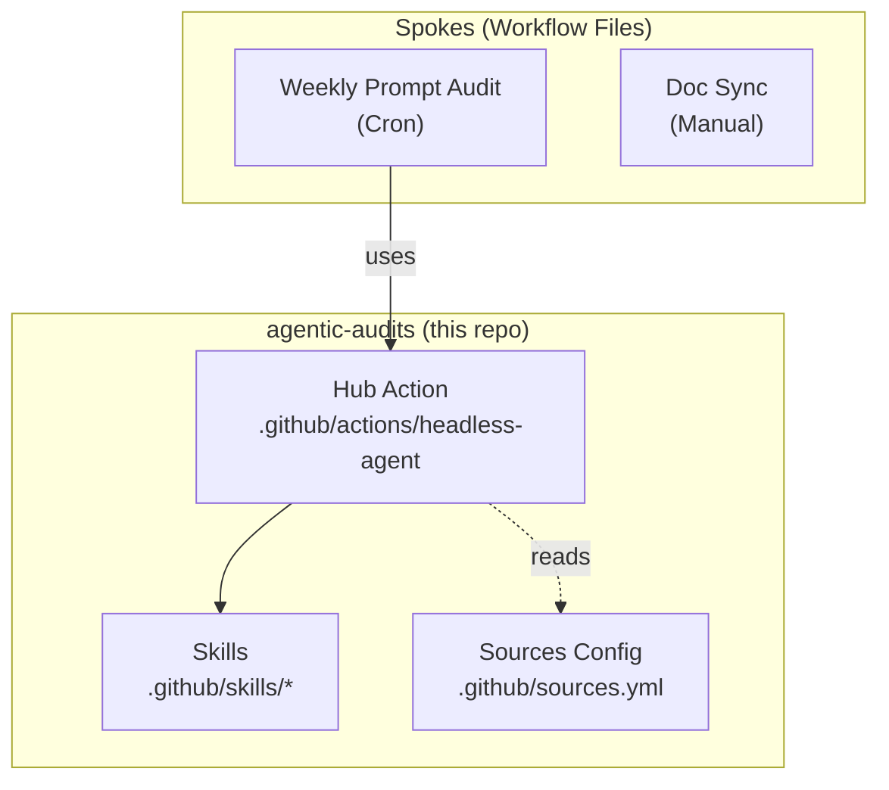

# Agentic Audits

> Automated governance for AI assets using headless GitHub Copilot agents.

## Overview

This repository provides a **Hub and Spoke** architecture for running headless AI agent workflows that audit, review, and refactor code and prompts.



### File Structure
```bash
.
├── .github/
│   ├── actions/
│   │   └── headless-agent/action.yml   ← The Hub (Composite Action)
│   ├── skills/                         ← Reusable Copilot Skills
│   │   ├── prepare-pr/SKILL.md         ← Skill: create PRs from changes
│   │   ├── docs-writer/SKILL.md        ← Skill: write/update documentation
│   │   └── code-reviewer/SKILL.md      ← Skill: structured code review
│   ├── workflows/
│   │   ├── weekly-prompt-audit.yml     ← Example Spoke (Cron)
│   │   └── sync-docs.yml              ← Example Spoke (Manual)
│   └── sources.yml                     ← Configurable documentation sources
├── prompts/                            ← Your prompt files (audited weekly)
├── docs/
│   └── internal-guide.md              ← Internal docs (synced on demand)
└── README.md
```

## Setup

1. **Add Secrets**: Add `COPILOT_GOV_TOKEN` to your repo secrets.
2. **Review Sources**: Check `.github/sources.yml` to enable/disable documentation sources.
3. **Local Development (Optional)**:
   - Run `npm install` to set up dependencies.


## Hub Action (`.github/actions/headless-agent`)

The core logic resides here. It installs the `gh` CLI, the Copilot extension, and handles authentication.

### Inputs

| Input | Required | Default | Description |
|-------|----------|---------|-------------|
| `mission` | ✅ | — | The agent mission prompt to execute |
| `context_files` | | `.` | File paths or globs for the agent to consider |
| `github_token` | ✅ | — | GitHub token with Copilot access |
| `model` | | *(auto)* | Primary Copilot model (e.g. `gpt-5-mini`, `claude-sonnet-4`) |
| `fallback_model` | | *(none)* | Fallback model if primary hits quota |
| `sources_config` | | `.github/sources.yml` | Path to YAML config for extra documentation sources |

### What it does

1. **Sets up** GitHub CLI and `gh-copilot` extension.
2. **Loads** `.github/sources.yml` to configure MCP servers and web documentation sources.
3. **Authenticates** with the provided token.
4. **Executes** `gh copilot suggest --target shell` with the mission prompt.
5. **Falls back** to the `fallback_model` if the primary model fails (e.g. quota exceeded).

---

## Configurable Sources (`.github/sources.yml`)

Control which external documentation the agent can access:

```yaml
sources:
  - name: context7
    type: mcp
    package: "@upstash/context7-mcp"
    enabled: true

  - name: langchain-docs
    type: web
    url: "https://python.langchain.com/docs/"
    enabled: true
```

---

## Adding a Spoke

Create a new workflow file in `.github/workflows/` that uses the hub action.

**Example:**

```yaml
name: "My Custom Audit"
on: workflow_dispatch

jobs:
  audit:
    runs-on: ubuntu-latest
    steps:
      - uses: actions/checkout@v4
      - uses: ./.github/actions/headless-agent
        with:
          mission: |
            Review src/*.ts files for security vulnerabilities.
            Be specific about what files to review and what to look for.
          context_files: "src/**/*.ts"
          github_token: ${{ secrets.COPILOT_GOV_TOKEN }}
          model: "gpt-4o-mini"
          fallback_model: "gpt-4o"
          sources_config: ".github/sources.yml"
```

---

## Copilot Skills

Reusable skills located in `.github/skills/` provide structured instructions for common tasks.
Reference them in your mission prompt: "Use the `prepare-pr` skill to create a PR."

Check the `SKILL.md` files for usage details.
