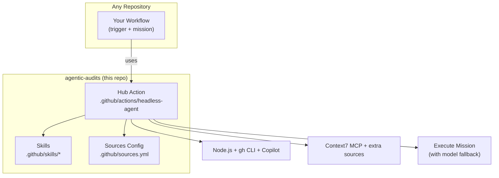

# agentic-audits

> Automated governance for AI assets using headless GitHub Copilot agents.

## Overview

This repository provides a **reusable Hub action** for running headless AI agent workflows that audit, review, and refactor code and prompts — plus example "spoke" workflows and Copilot Skills you can copy into any repository.



### File Tree

```
.
├── .github/
│   ├── actions/
│   │   └── headless-agent/
│   │       └── action.yml              ← Hub (Composite Action)
│   ├── skills/
│   │   ├── prepare-pr/SKILL.md         ← Skill: create PRs from changes
│   │   ├── docs-writer/SKILL.md        ← Skill: write/update documentation
│   │   └── code-reviewer/SKILL.md      ← Skill: structured code review
│   ├── workflows/
│   │   ├── weekly-prompt-audit.yml     ← Example Spoke (Cron)
│   │   └── sync-docs.yml              ← Example Spoke (Manual)
│   └── sources.yml                     ← Configurable documentation sources
├── prompts/                            ← Your prompt files (audited weekly)
├── docs/
│   └── internal-guide.md              ← Internal docs (synced on demand)
└── README.md
```

---

## Quick Start

### 1. Create the `COPILOT_GOV_TOKEN` secret

1. Go to **Settings → Secrets and variables → Actions**.
2. Click **New repository secret**.
3. **Name:** `COPILOT_GOV_TOKEN`
4. **Value:** A GitHub PAT with **Copilot** access.

### 2. Use the Hub action in your workflow

The hub action can be used **from this repository or from any other repository**:

```yaml
# In YOUR repository's .github/workflows/my-audit.yml
name: "My Custom Audit"
on:
  workflow_dispatch:

jobs:
  audit:
    runs-on: ubuntu-latest
    steps:
      - uses: actions/checkout@v4

      - uses: your-org/agentic-audits/.github/actions/headless-agent@main
        with:
          mission: "Review all Python files for security issues."
          context_files: "src/**/*.py"
          github_token: ${{ secrets.COPILOT_GOV_TOKEN }}
          model: "gpt-4o"
          fallback_model: "gpt-4o-mini"
```

> **Tip:** Replace `your-org/agentic-audits` with the actual owner/repo, or use `./.github/actions/headless-agent` if the workflow lives in this repository.

---

## Hub Action Reference

### Inputs

| Input | Required | Default | Description |
|-------|----------|---------|-------------|
| `mission` | ✅ | — | The agent mission prompt to execute |
| `context_files` | | `.` | File paths or globs for the agent to consider |
| `github_token` | ✅ | — | GitHub token with Copilot access |
| `model` | | *(auto)* | Primary Copilot model (e.g. `gpt-4o`, `claude-sonnet-4`) |
| `fallback_model` | | *(none)* | Fallback model if primary hits quota |
| `sources_config` | | `.github/sources.yml` | Path to YAML config for extra documentation sources |

### What it does

1. **Installs** Node.js 20, `gh` CLI, and the `gh-copilot` extension.
2. **Loads** `.github/sources.yml` to configure MCP servers and web documentation sources.
3. **Authenticates** with the provided token.
4. **Executes** `gh copilot suggest --cli` with the mission prompt.
5. **Falls back** to the `fallback_model` if the primary model fails (e.g. quota exceeded).

---

## Configurable Sources (`.github/sources.yml`)

Control which external documentation the agent can access:

```yaml
sources:
  # MCP servers — installed via npm and registered with Copilot
  - name: context7
    type: mcp
    package: "@modelcontextprotocol/server-context7"
    enabled: true

  # Web sources — URLs injected into the mission prompt
  - name: langchain-docs
    type: web
    url: "https://python.langchain.com/docs/"
    enabled: true

  - name: openai-api-ref
    type: web
    url: "https://platform.openai.com/docs/api-reference"
    enabled: false   # disabled — won't be used
```

| Field | Description |
|-------|-------------|
| `name` | Unique identifier for the source |
| `type` | `mcp` (Model Context Protocol server) or `web` (URL) |
| `package` | *(mcp only)* npm package name |
| `url` | *(web only)* Documentation URL |
| `enabled` | Set `false` to disable without removing |

---

## Copilot Skills

Skills are reusable instruction sets in `.github/skills/` that Copilot automatically discovers and applies when relevant to a mission.

| Skill | Purpose |
|-------|---------|
| [`prepare-pr`](.github/skills/prepare-pr/SKILL.md) | Create branches, commit changes, and open structured PRs |
| [`docs-writer`](.github/skills/docs-writer/SKILL.md) | Write or update documentation with consistent formatting |
| [`code-reviewer`](.github/skills/code-reviewer/SKILL.md) | Structured code review with severity levels and actionable fixes |

### Adding custom skills

Create a new directory under `.github/skills/` with a `SKILL.md` file:

```markdown
---
name: my-custom-skill
description: >
  One-line description of when Copilot should use this skill.
---

# My Custom Skill

## When to use
...

## Instructions
...
```

> Browse community skills at [skillsmp.com](https://skillsmp.com/) for inspiration and ready-made skill definitions.

---

## Example Spokes

The workflows in `.github/workflows/` are **examples** — copy and adapt them for your own use cases.

### Weekly Prompt Audit

**Trigger:** Cron (every Monday 07:00 UTC) + manual  
**Mission:** Review all markdown files in `/prompts` for clarity, safety, and conciseness.

### On-Demand Doc Sync

**Trigger:** Manual (`workflow_dispatch`)  
**Mission:** Fetch latest external docs via Context7 and update an internal guide.

### Creating your own spoke

```yaml
name: "My Custom Audit"
on:
  schedule:
    - cron: "0 9 * * 5"  # every Friday at 09:00 UTC
  workflow_dispatch:

jobs:
  audit:
    runs-on: ubuntu-latest
    steps:
      - uses: actions/checkout@v4
      - uses: your-org/agentic-audits/.github/actions/headless-agent@main
        with:
          mission: |
            Your detailed mission prompt here.
            Be specific about what files to review and what to look for.
          context_files: "src/**/*.ts"
          github_token: ${{ secrets.COPILOT_GOV_TOKEN }}
          model: "gpt-4o"
          fallback_model: "gpt-4o-mini"
          sources_config: ".github/sources.yml"
```

---

## License

See [LICENSE](LICENSE).
